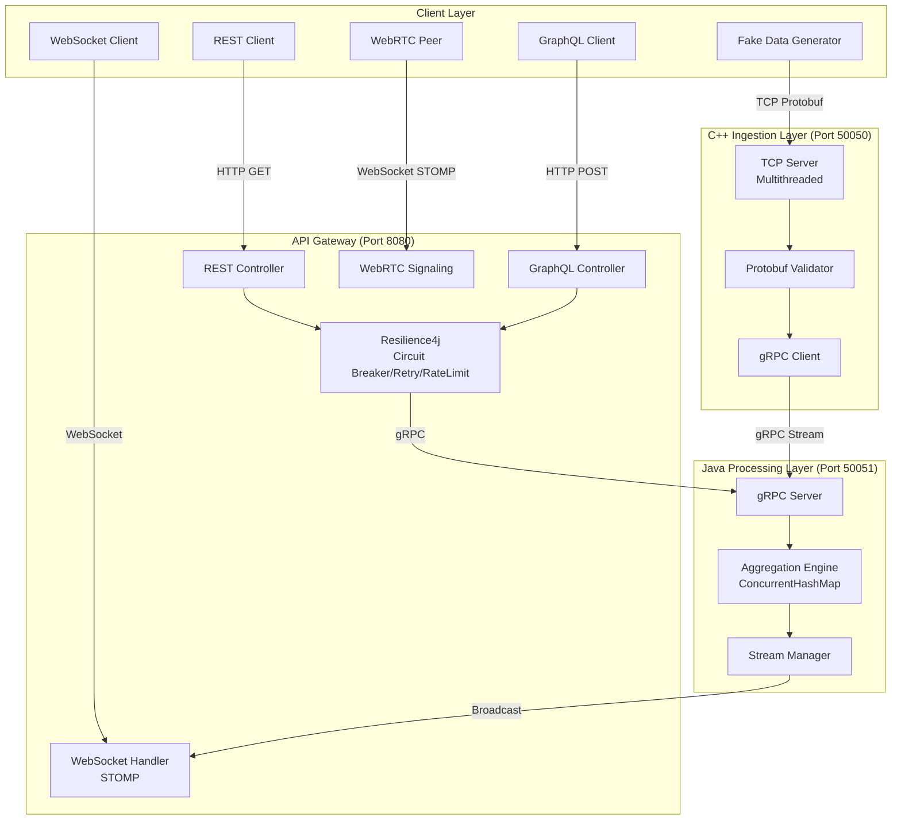

# System Architecture

## Overview
The Market Data Server is a **production-grade**, **multi-protocol** real-time data system demonstrating modern distributed architecture patterns. It processes high-velocity market data through a layered pipeline: **TCP ingestion** → **gRPC streaming** → **in-memory aggregation** → **multi-protocol distribution** (REST, GraphQL, WebSocket, WebRTC).

**Status**: ✅ All 10 phases complete

---

## High-Level Architecture



---

## Component Details

### 1. Ingestion Layer (C++)

**File**: `src/server.cpp`  
**Role**: High-performance data ingestion

**Features**:
- **Multithreaded TCP Server** (Port 50050)
- **Length-Prefixed Framing**: Handles TCP stream boundaries
- **Protobuf Deserialization**: Parses `Tick` messages
- **Validation**: Price > 0, valid timestamps
- **gRPC Client**: Streams validated ticks to Java backend

**Key Technologies**:
- C++20 (std::thread, std::mutex)
- Google Protobuf
- gRPC C++ Client

**Performance**:
- Serialization: ~X M ops/s (see `benchmark_serialization`)
- Concurrent client connections: Limited by OS (ulimit)

---

### 2. Processing Layer (Java)

**Module**: `java-aggregator/app`  
**Main Class**: `MarketDataServiceImpl.java`

**Features**:
- **gRPC Server** (Port 50051): Receives `StreamTicks` RPC
- **Aggregation Engine**: 
  - `ConcurrentHashMap<Symbol, Aggregate>`
  - OHLC computation (Open, High, Low, Close)
  - Volume accumulation
  - Timestamp tracking
- **Thread Safety**: Atomic operations via `LongAdder`

**Key Technologies**:
- Java 17
- gRPC Java Server
- Spring Boot (for dependency injection)

**Endpoints**:
- `StreamTicks(stream Tick) returns Ack`
- `GetAggregate(AggregateRequest) returns Aggregate`
- `StreamAggregates(AggregateRequest) returns stream Aggregate`

---

### 3. Distribution Layer (API Gateway)

**Module**: `java-aggregator/api-gateway`  
**Port**: 8080

#### 3.1 REST API
**Controller**: `MarketDataController.java`  
**Endpoint**: `GET /api/v1/marketdata/{symbol}`

Returns:
```json
{
  "symbol": "AAPL",
  "open": 150.25,
  "high": 152.10,
  "low": 149.80,
  "close": 151.50,
  "volume": "1000000",
  "timestamp": "1735201234567"
}
```

#### 3.2 GraphQL API
**Controller**: `MarketDataGraphQLController.java`  
**Endpoint**: `/graphql`, `/graphiql`

**Schema**:
```graphql
type Query {
  marketData(symbol: String!): Aggregate
}

type Aggregate {
  symbol: String
  open: Float
  high: Float
  low: Float
  close: Float
  volume: String
  timestamp: String
}
```

**Client-Driven**: Fetch only required fields

#### 3.3 WebSocket Streaming
**Config**: `WebSocketConfig.java`  
**Service**: `GrpcStreamManager.java`

**Flow**:
1. Client connects to `/ws` (SockJS)
2. Subscribes to `/topic/market-data/{symbol}`
3. `GrpcStreamManager` consumes `StreamAggregates` from Java backend
4. Broadcasts updates via `SimpMessagingTemplate`

**Protocol**: STOMP over WebSocket

#### 3.4 WebRTC Signaling
**Controller**: `SignalingController.java`  
**Endpoint**: `@MessageMapping("/signal")`

**Message Types**:
- `OFFER`: WebRTC session description
- `ANSWER`: Response to offer
- `ICE`: ICE candidate for NAT traversal

**Relay Logic**: Broadcasts to `/topic/signaling`

#### 3.5 Resilience Layer
**Service**: `MarketDataClientService.java`  
**Library**: Resilience4j

**Patterns**:
- **Circuit Breaker**: Opens after 50% failure rate (10 calls window)
- **Retry**: Max 3 attempts, 500ms wait
- **Rate Limiter**: 10 requests/second
- **Fallback**: Returns empty `AggregateDTO` on failure

---

## Data Flow (End-to-End)

### Example: Real-Time Price Update

1. **Generation** (T+0ms):
   ```
   fake_client sends: 
   {symbol: "AAPL", price: 150.25, volume: 100, timestamp: T}
   ```

2. **Ingestion** (T+1ms):
   ```
   C++ server receives TCP frame → deserializes Protobuf → validates
   ```

3. **Internal Transport** (T+2ms):
   ```
   gRPC client streams Tick to Java (port 50051)
   ```

4. **Aggregation** (T+3ms):
   ```
   Java updates: aggregates["AAPL"].close = 150.25
                 aggregates["AAPL"].volume += 100
   ```

5. **Streaming** (T+4ms):
   ```
   StreamManager → WebSocket → Connected clients receive JSON
   ```

6. **Client Receives** (T+5ms):
   ```
   Browser displays: "AAPL: $150.25 (Vol: 1,234,567)"
   ```

**Total Latency**: ~5ms (local network)

---

## Technology Stack Summary

| Layer | Technologies |
|-------|-------------|
| **Ingestion** | C++20, TCP Sockets, Protobuf, gRPC (Client) |
| **Processing** | Java 17, gRPC (Server), Spring Boot, ConcurrentHashMap |
| **Gateway** | Spring Boot 3, Spring Web, Spring GraphQL, Spring WebSocket |
| **Resilience** | Resilience4j (Circuit Breaker, Retry, RateLimiter) |
| **Protocols** | TCP, gRPC (HTTP/2), REST (HTTP/1.1), GraphQL, WebSocket (STOMP), WebRTC |
| **Serialization** | Protobuf, JSON |
| **Build Tools** | CMake, Gradle |

---

## Scaling Considerations

### Vertical Scaling
- ✅ C++ server: Increase thread pool
- ✅ Java: Increase heap size (`-Xmx4g`)

### Horizontal Scaling
- ⚠️ **Requires State Externalization**:
  - Replace in-memory `ConcurrentHashMap` with Redis
  - Use Kafka for event streaming
  - Add load balancer (NGINX, AWS ALB)
  - Session affinity for WebSocket

### Performance Optimizations
- Use gRPC connection pooling
- Enable HTTP/2 multiplexing
- Add CDN for static assets
- Implement message batching

---

## Security Considerations

**Current State**: ⚠️ **No authentication** (demo/local use only)

**Production Enhancements**:
1. **Authentication**:
   - JWT tokens for REST/GraphQL
   - WebSocket STOMP authentication headers
2. **Authorization**:
   - Role-based access control (RBAC)
   - Symbol-level permissions
3. **Encryption**:
   - TLS/HTTPS for all HTTP traffic
   - gRPC with mTLS
4. **Rate Limiting**:
   - Per-user quotas (currently global)
   - DDoS protection (Cloudflare, AWS Shield)

---

## Monitoring & Observability

**Recommended Stack**:
- **Metrics**: Prometheus + Grafana
- **Logs**: ELK Stack (Elasticsearch, Logstash, Kibana)
- **Tracing**: Jaeger (OpenTelemetry)
- **APM**: New Relic, Datadog

**Key Metrics to Track**:
- Tick ingestion rate (msgs/sec)
- gRPC stream health
- API response times (p50, p95, p99)
- Circuit breaker state
- WebSocket connection count

---

## Comparison: Protocol Trade-offs

| Protocol | Use Case | Pros | Cons |
|----------|----------|------|------|
| **TCP** | Raw ingestion | Low latency, reliable | Manual framing |
| **gRPC** | Inter-service | Fast, typed, streaming | Complex setup |
| **REST** | Simple queries | Universal, cacheable | Verbose, over-fetching |
| **GraphQL** | Flexible queries | Client-driven, efficient | Server complexity |
| **WebSocket** | Real-time push | Bidirectional, low latency | Stateful connections |
| **WebRTC** | P2P media | Direct connection, low latency | NAT traversal complexity |

---

## Design Decisions

### Why C++ for Ingestion?
- **Performance**: Close to hardware, minimal overhead
- **Control**: Manual memory management for predictable latency
- **Learning**: Understanding low-level networking

### Why Java for Aggregation?
- **Concurrency**: Excellent thread-safe collections
- **Ecosystem**: Rich libraries (Spring, gRPC)
- **maintainability**: Easier than C++ for business logic

### Why Spring Boot for Gateway?
- **Rapid Development**: Auto-configuration
- **Integration**: REST, GraphQL, WebSocket in one stack
- **Production-Ready**: Actuator, metrics, health checks

---

## Future Architecture Evolution

### Phase 11: Event Sourcing (Proposed)
- Replace stateful aggregator with event log (Kafka)
- Replay events for testing/debugging
- Materialized views for different queries

### Phase 12: Multi-Region (Proposed)
- Deploy in multiple AWS regions
- Use Route 53 for geo-routing
- CockroachDB for global consistency

### Phase 13: Machine Learning (Proposed)
- Real-time anomaly detection
- Price prediction models
- Integrate TensorFlow Serving

---

## Conclusion

This architecture demonstrates a **complete data pipeline** from raw bytes to multi-protocol distribution, showcasing:
- ✅ Low-level networking (C++)
- ✅ High-level APIs (Java/Spring)
- ✅ Real-time streaming (WebSocket)
- ✅ Modern patterns (Circuit Breaker, GraphQL, WebRTC)
- ✅ Performance measurement

## Next Steps (Future Enhancements) (its hard to do but not impossible)

- [ ] Add Redis for distributed caching
- [ ] Implement Kafka for event streaming
- [ ] Add Prometheus/Grafana for metrics
- [ ] Implement authentication (OAuth2/JWT)
- [ ] Add database persistence (PostgreSQL)
- [ ] Horizontal scaling with Kubernetes
- [ ] Add frontend dashboard (React)
